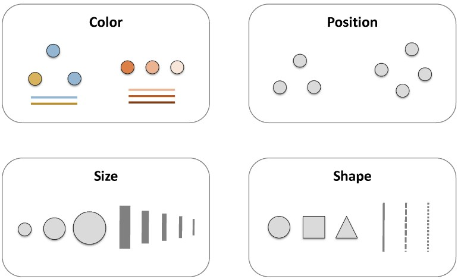

# { data-background="img/data-culture.jpg"}

## Estructura

Viajaremos por:

```{r, include = FALSE}
source("R/setup.R")
```

- Visualización de datos
- Definiciones
- Recomendaciones Técnicas & Visuales
- Ejercicios y concursos

## { data-background="https://media.giphy.com/media/LNE01Z89j9gis/giphy.gif"}

# Visualización de datos { .center .white data-background="#75AADB"}

## { data-background="http://img.kiosko.net/2017/07/18/uk/ft_uk.750.jpg"}

## { data-background="https://pbs.twimg.com/media/DSNbnLrXkAAibaB.jpg"}

<!-- https://twitter.com/sdbernard/status/946701218298126341  -->

## (Posible) Definición técnica:

Representación gráfica de datos __codificando la información__ como: posición, tamaño, formas, colores



## Visualización

Cosas importantes

- Lleva información, es un mensaje
- Ejercicio mental para interpretar o __decodificar__(!!) información
- No siempre es el fin
- Herramienta exploratoria
- Distintas visualizaciones en mismos datos / Distintas historias

----

```{r}
data(gapminder, package = "gapminder")

gapminder %>% 
  distinct(country, continent) %>% 
  count(continent) %>% 
  ggplot() +
  geom_col(aes(continent, n, fill = continent), width = 0.5) + 
  scale_fill_viridis(option = "D", discrete = TRUE, guide = FALSE) +
  labs(
    title = "Cantidad de países por continente",
    subtitle = "Un interesante subtitulo para contexto y dar detalles quizás puede ser\nmás largo pero quien soy yo para decir que se debe y lo que no",
    caption = "Importante mencionar la fuente, en caso contrario no me creen",
    x = "Contienentes",
    y = "Países"
    ) + 
  theme(plot.subtitle = element_text(size = 9))
```

----

```{r}
gapminder %>% 
  group_by(country) %>% 
  filter(row_number() == n()) %>% 
  ungroup() %>% 
  ggplot() + 
  geom_point(aes(lifeExp, gdpPercap, size = pop, color = continent), alpha = 0.7) +
  scale_color_viridis(option = "D", discrete = TRUE) + 
  scale_y_sqrt(name = "GDP per Capita", labels = comma, limits = c(NA, NA)) +
  scale_x_continuous(name = "Esperanza de vida", labels = comma, limits = c(NA, NA)) +
  scale_size(labels = comma, range = c(3, 10), breaks = c(100, 1000, 2000)*1e6)
```

----

```{r}
data(legosets , package = "lego")
ggplot(legosets) + 
  geom_point(aes(Pieces, USD_MSRP, size = Minifigures, color = Year), alpha = 0.7) +
  scale_color_viridis(option = "A") + 
  scale_y_sqrt(name = "Precio USD", labels = dollar, limits = c(0, 300)) +
  scale_x_sqrt(name = "Piezas", labels = comma, limits = c(0, 2000)) 
```

----

```{r}
legosets %>% 
  mutate(year2 = floor(Year/10)*10) %>% 
  select(year2, Year, everything()) %>% 
  ggplot() +
  geom_jitter(aes(factor(year2), USD_MSRP, size = Pieces, color = Year), alpha = 0.5, width = 0.25) +
  scale_color_viridis(option = "A") + 
  scale_y_continuous(name = "Precio USD", labels = dollar, limits = c(0, 300)) + 
  scale_x_discrete(name = "Década") 
```

----

```{r}
# install.packages(c("rgexf", "ggnetwork", "intergraph"))
# 316
library(tidyverse)
library(viridis)
library(igraph)
library(rgexf)
library(stringr)
library(ggnetwork)
library(ggrepel)

net <- "http://media.moviegalaxies.com/gexf/92.gexf" %>% 
  read_lines() %>% 
  read.gexf() %>% 
  gexf.to.igraph()

V(net)$name <- str_to_title(V(net)$name)
V(net)$label <- V(net)$name %>% 
  str_extract_all("^\\w{2}| \\w") %>% 
  map_chr(function(x) {
    x %>% unlist() %>% str_c(collapse = "")
  })
V(net)$size <- page.rank(net)$vector
cl <- cluster_fast_greedy(net)
V(net)$comm <- membership(cl)

f <- colorRamp(viridis::inferno(10))
c <- (V(net)$comm/max(V(net)$comm)) %>% f() %>% {./255} %>% rgb()
V(net)$color <- c

# head(ggnetwork(net))
set.seed(123)
ggnet <- ggnetwork(net)
dfnet2 <- ggnet %>%
  as.matrix() %>%
  as.data.frame() %>%
  tbl_df() %>%
  select(x, y, vertex.names, weight, size) %>%
  mutate_all(as.character) %>%
  mutate_at(vars(x, y, weight, size), as.numeric) %>%
  filter(is.na(weight))

ggplot(ggnet) + 
  geom_edges(aes(x, y, size = width, color = factor(comm),
           xend = xend, yend = yend), color = "gray", size = 1, alpha = 0.4) +
  geom_point(aes(x, y, size = size, color = factor(comm))) +
  geom_text_repel(aes(x, y, label = vertex.names, size = size),
                  data = dfnet2, color = "#666666",
                  family = "Roboto Condensed") +
  scale_color_viridis(discrete = TRUE) + 
  theme_blank() +
  labs(size = "Importancia", color = "Grupo")
```

----

## ¿Existe el mejor gráfico? { .left data-background="img/data-visualization-tools-concept.png"}

## Ejercicio

Cual de las siguientes formas funciona mejor con el títutlo:

<span class="fragment">
_La región del sur exhibe el mayor crecimiento_
<br>
<small>
Adapatado del tweet de [Lisa Charlotte Rost](https://twitter.com/lisacrost/status/948233069110222848)
que a su vez está viene del ejemplo del libro "Show me the numbers" de Stephen Few
</small>
</span>

## Ejercicio

Los datos:

```{r}
data1 <- read_delim("data/showmethenumbers.txt", delim = "\t") %>% 
  mutate(region = factor(region, levels = c("sur", "norte", "este", "oeste")))
titulo <- "La región del sur exhibe el mayor crecimiento"
data1 %>% 
  spread(cuarto, valor) %>% 
  arrange(region) %>% 
  knitr::kable()
```

----

```{r}
p1 <- ggplot(data1) +
  geom_col(aes(cuarto, valor, group = region, fill = region),
           color = "gray80", position = "dodge") +
  scale_fill_viridis(discrete = TRUE, end = 0.80)
p1 + labs(title = titulo)
```

----

```{r}
p2 <- ggplot(data1) +
  geom_col(aes(region, valor, group = cuarto, fill = region),
           color = "gray80", position = "dodge") +
  scale_fill_viridis(discrete = TRUE, end = 0.80)
p2 + labs(title = titulo)
```

----

```{r}
p3 <- data1 %>% 
  mutate(ind = as.numeric(region == "sur")) %>%
  ggplot() +
  geom_line(aes(cuarto, valor, group = region, alpha = ind, color = region), size = 2) +
  scale_y_continuous(limits = c(0, NA)) + 
  scale_alpha(range = c(0.5, 1), guide = FALSE) +
  scale_color_viridis(discrete = TRUE, end = 0.80) 
p3 + labs(title = titulo)
```

----

```{r, fig.width=12}
gridExtra::grid.arrange(
  p1 + theme(axis.text.y = element_blank(), legend.position="none"),
  p2 + theme(axis.text.y = element_blank(), legend.position="none"),
  p3 + theme(axis.text.y = element_blank(), legend.position="none"),
  nrow = 1)
```

## (Posible) Respuesta

<br>
No. Dependerá de tu mensaje, de tu historia.

# Recomendaciones Técnicas { .center .white data-background="#F44336"}

## Pie Charts (o tortas)

<!-- https://twitter.com/MetricsHulk/status/728014668913102848 -->


## Pie Charts (o tortas)

Usuales dificultades

- Compara áreas
- Ejercicio mental de rotar para comparar categorías

----

Es muy usado es el __pie chart__

```{r}
legos2 <- legosets %>% 
  mutate(Theme2 = fct_lump(Theme, n = 7)) %>% 
  filter(Theme2 != "Other")
  
p1 <- ggplot(legos2) +
  geom_bar(aes(Theme, fill = Theme)) +
  scale_fill_viridis(discrete = TRUE, option = "B", end = 0.7) +
  theme_null() + 
  xlab(NULL) + ylab(NULL)

p2 <- ggplot(legos2) +
  geom_bar(aes(x = factor(1), fill = Theme), width = 1) +
  scale_fill_viridis(discrete = TRUE, option = "B", end = 0.7) +
  coord_polar(theta = "y") +
  theme_null()

gridExtra::grid.arrange(p1, p2, nrow = 1)
```

----

Es muy (__ab__)usado es el __pie chart__

```{r}
legos3 <- legosets %>% 
  mutate(Theme2 = fct_lump(Theme, n = 15)) %>% 
  filter(Theme2 != "Other")

p1 <- ggplot(legos3) +
  geom_bar(aes(Theme, fill = Theme)) +
  scale_fill_viridis(discrete = TRUE, option = "B") +
  theme_null() + 
  xlab(NULL) + ylab(NULL)

p2 <- ggplot(legos3) +
  geom_bar(aes(x = factor(1), fill = Theme), width = 1) +
  scale_fill_viridis(discrete = TRUE, option = "B") +
  coord_polar(theta = "y") +
  theme_null()

gridExtra::grid.arrange(p1, p2, nrow = 1)
```

----


## Puntos de Referencia { .right data-background="img/map-location-pin.jpg"} 

## Puntos de Referencia


## Puntos de Referencia


## Puntos de Referencia

```{r}
data2 <- data_frame(
  indice = c(30.7, 22.8, 27.3),
  tiempo = c(2010, 2013, 2016),
  c = c("r", "b", "r")
)

ggplot(data2, aes(factor(tiempo), indice)) + 
  geom_col(aes(fill = c), width = 0.75) +
  geom_text(aes(label = paste0(indice, "%")), color = "white", size = 5, vjust = 2) +
  scale_color_manual(values = c("#D61740", "#195E87")) +
  labs(x = "Año", y = "Índice") + 
  theme(axis.text.y = element_blank(), legend.position="none")
```

## Convenciones (Ejercicio 2)

<!-- https://twitter.com/MetricsHulk/status/735913911212515329 -->


## Convenciones


# Recomendaciones Estilo { .center .white data-background="#607D8B"}

## Tipografía

Conocen a ..?

<span class="fragment"><h1><font face="Arial">Arial</font></h1></span>
<span class="fragment"><h1><font face="Times New Roman">Times New Roman</font></h1></span>
<span class="fragment"><h1><font face="Comic Sans MS">Comic Sans</font></h1></span>

## { data-background="img/comicsanscriminal.png"}

## Cada vez que veo(mos) Comic Sans { .white .right data-background="https://media.giphy.com/media/7yDthHaq2haXS/giphy.gif"}

## Tipografía

Según <font face="Comic Sans MS">[comic sans criminal](http://www.comicsanscriminal.com/)</font>:

- Fuentes tienen personalidad
- Tiene un propósito
- Armonía en el universo

## { data-background="https://i.pinimg.com/736x/a4/60/86/a460865501618b73cf64db7f4b345745--middle-earth-map-hobbit-party.jpg"}

## Colores

La misma idea de las convenciones!

## Colores

```{r}
df <- data_frame(
  pais = c("Chile", "Colombia", "Argentina", "Bolivia"),
  crecimiento = c(6, 5, 4, 4)/10
) %>% 
  mutate(pais = fct_inorder(pais))

ggplot(df) +
  geom_col(aes(pais, crecimiento, fill = pais), width = 0.5) + 
  scale_y_percent() +
  scale_fill_manual(values = sample(c("#C8152B", "#FDD116", "#4F75AF", "#2C9A05"))) +
  theme(legend.position = "none")

```

## Colores

```{r}
ggplot(df) +
  geom_col(aes(pais, crecimiento, fill = pais), width = 0.5) + 
  scale_y_percent() +
  scale_fill_manual(values = c("#C8152B", "#FDD116", "#4F75AF", "#2C9A05")) +
  theme(legend.position = "none")
```

## Colores

```{r}
ggplot(df) +
  geom_col(aes(pais, crecimiento, fill = pais), width = 0.5) + 
  scale_y_percent() +
  scale_fill_manual(values = c("#C8152B", "#555555", "#555555", "#555555")) +
  theme(legend.position = "none")
```


## { data-background="https://media.giphy.com/media/JzOyy8vKMCwvK/giphy.gif" }

# Espero haya servido! Conversemos! { .center .white data-background="#673AB7" }

